<p align="center">
  
</p>

<h1 align="center">FinRAG</h1>

<p align="center">
  <strong>Enterprise-grade Retrieval-Augmented Generation for Financial Documents</strong>
</p>

<p align="center">
  <a href="https://finrag.info">Live Demo</a> ·
  <a href="https://github.com/Syndicate555/financial-rag">Frontend Repo</a> ·
  <a href="#architecture">Architecture</a> ·
  <a href="#deployment">Deployment</a> ·
  <a href="docs/ARCHITECTURE.md">Full Architecture Docs</a> ·
  <a href="docs/DEPLOYMENT.md">Full Deployment Docs</a>
</p>

<p align="center">
  
  
  
  
  
  
  
  
  
</p>

---

## Overview

FinRAG lets you upload financial documents — annual reports, MD&A filings, earnings releases — and ask questions in natural language. The system parses, chunks, and embeds the document into a vector store, then uses retrieval-augmented generation to produce answers **grounded in the source material** with page-level citations.

### Key Features

- **Structured PDF Parsing** — Azure Document Intelligence extracts tables, headings, and sections with semantic understanding. Falls back to heuristic parsing (pdfplumber) when unavailable.
- **Intelligent Query Routing** — A lightweight classifier (GPT-4o-mini) routes each question to the right handler: document retrieval, general knowledge, or clarification.
- **Streaming Responses with Citations** — Answers stream in real-time via SSE. Citations with page ranges and relevance scores arrive before the first token.
- **Section-Level Clarification** — When a query is ambiguous ("tell me about banking"), the system suggests specific document sections to narrow the scope.
- **Message Feedback** — Thumbs up/down on every answer for quality tracking.
- **Scale-to-Zero** — The backend runs on Azure Container Apps with 0–1 replicas. Costs ~$0 when idle.

---

## Architecture

### System Overview


### RAG Pipeline

The core of the system is a two-phase pipeline: **ingestion** (upload-time) and **retrieval** (query-time).

```mermaid
graph LR
    subgraph Ingestion["📄 Document Ingestion"]
        Upload["Upload PDF"]
        Parse["Parse<br/>Azure DI or pdfplumber"]
        Chunk["Chunk<br/>512 tokens, 64 overlap"]
        Embed["Embed<br/>text-embedding-3-large"]
        Store["Store<br/>Pinecone + Supabase"]

        Upload --> Parse --> Chunk --> Embed --> Store
    end

    subgraph Retrieval["💬 Query & Response"]
        Query["User Question"]
        Route["Route<br/>GPT-4o-mini classifier"]
        Retrieve["Retrieve<br/>Pinecone top-k=20"]
        Generate["Generate<br/>GPT-4o stream"]
        Respond["Stream Answer<br/>+ Citations"]

        Query --> Route --> Retrieve --> Generate --> Respond
    end

    style Ingestion fill:#f0f4ff,stroke:#1D4ED8,color:#000
    style Retrieval fill:#f0fdf4,stroke:#10B981,color:#000
```



### Query Routing

Not every question needs document retrieval. The router classifies each query to optimize cost and quality:


### Document Processing


---

## Infrastructure & Deployment

### Cloud Architecture

```mermaid
graph TB
    subgraph GH["GitHub — Syndicate555/finrag-backend"]
        Code["Source Code"]
        Actions["GitHub Actions<br/>deploy-backend.yml"]
        Secrets["GitHub Secrets<br/>14 encrypted secrets"]
    end

    subgraph Azure["Azure — Resource Group: pwc-rag-rg (West US)"]
        ACR["Container Registry<br/>cac2a1babdc1acr.azurecr.io<br/>Basic SKU"]
        subgraph ACA["Container Apps Environment: pwc-rag-env"]
            App["Container App: pwc-rag-api<br/>0.5 vCPU · 1GB RAM<br/>Scale: 0–1 replicas<br/>Port 8000 · External HTTPS"]
        end
        Logs["Log Analytics<br/>pwc-rag-logs<br/>30-day retention"]
        SP["Service Principal<br/>finrag-backend-deploy<br/>Contributor on pwc-rag-rg"]
    end

    subgraph Vercel["Vercel"]
        FE["Next.js Frontend<br/>finrag.info<br/>www.finrag.info"]
    end

    Code -->|"push to main"| Actions
    Actions -->|"docker build + push"| ACR
    Actions -->|"az containerapp update"| App
    SP -.->|"authenticates"| Actions
    ACR -->|"pull image"| App
    App --> Logs

    FE -->|"HTTPS / SSE"| App

    style GH fill:#24292e,stroke:#fff,color:#fff
    style Azure fill:#0078D4,stroke:#fff,color:#fff
    style Vercel fill:#000,stroke:#fff,color:#fff
    style ACR fill:#0078D4,stroke:#fff,color:#fff
    style App fill:#005a9e,stroke:#fff,color:#fff
```



### CI/CD Pipeline

Every push to `main` that changes `backend/**` triggers an automated build and deploy

```mermaid
sequenceDiagram
    participant Dev as Developer
    participant GH as GitHub
    participant Runner as GitHub Actions Runner
    participant ACR as Azure Container Registry
    participant ACA as Azure Container Apps

    Dev->>GH: git push origin main
    GH->>Runner: Trigger workflow<br/>(backend/** changed)

    Runner->>Runner: Checkout code
    Runner->>ACR: Docker login (admin creds)
    Runner->>ACR: Build & push image<br/>tags: {sha}, latest
    Runner->>ACA: az login (service principal)
    Runner->>ACA: az containerapp update<br/>new image + env vars

    ACA->>ACR: Pull image
    ACA->>ACA: Create new revision<br/>route 100% traffic

    Note over Dev,ACA: Total time: ~1.5–2 minutes
```



### Deployment Targets

| Component        | Platform             | URL                                                              | Deploys On                        |
| ---------------- | -------------------- | ---------------------------------------------------------------- | --------------------------------- |
| **Backend API**  | Azure Container Apps | `pwc-rag-api.politemeadow-4143bf92.westus.azurecontainerapps.io` | Push to `main` (backend changes)  |
| **Frontend**     | Vercel               | `finrag.info`                                                    | Push to `main` (frontend repo)    |
| **Database**     | Supabase             | Managed PostgreSQL                                               | Manual migrations                 |
| **Vector Store** | Pinecone             | Managed index: `pwc-rag`                                         | Populated at document upload time |

---

## Data Model


> **Status values**: `pending` → `processing` → `ready` | `failed` > **Roles**: `user` | `assistant` · **Message types**: `kb` | `general` | `clarification` · **Feedback signal**: `+1` (like) | `-1` (dislike)
> **Cascade deletes**: Deleting a document removes its sections, threads, messages, and feedback.

---

## Tech Stack

### Backend

| Technology                      | Role                                                                                     |
| ------------------------------- | ---------------------------------------------------------------------------------------- |
| **Python 3.12**                 | Runtime                                                                                  |
| **FastAPI**                     | Async HTTP framework                                                                     |
| **Uvicorn**                     | ASGI server                                                                              |
| **OpenAI SDK**                  | Embeddings (text-embedding-3-large) + Chat (GPT-4o) + Routing (GPT-4o-mini)              |
| **Pinecone**                    | Vector storage and similarity search (1536 dimensions)                                   |
| **Supabase**                    | PostgreSQL database + PDF object storage                                                 |
| **Azure Document Intelligence** | Structured PDF parsing — tables, headings, sections (optional, with pdfplumber fallback) |
| **pdfplumber + PyMuPDF**        | Fallback PDF parsing with font-size heuristics                                           |
| **tiktoken**                    | Token counting for chunk sizing                                                          |
| **sse-starlette**               | Server-Sent Events for streaming responses                                               |
| **Pydantic Settings**           | Typed configuration from environment variables                                           |

### Frontend ([repo](https://github.com/Syndicate555/financial-rag))

| Technology            | Role                               |
| --------------------- | ---------------------------------- |
| **Next.js 16**        | React framework with App Router    |
| **React 19**          | UI library with React Compiler     |
| **TypeScript**        | Strict mode with branded types     |
| **Zustand**           | Thread list state management       |
| **Tailwind CSS v4**   | Utility-first styling              |
| **shadcn/ui + Radix** | Accessible component primitives    |
| **react-markdown**    | Markdown rendering with GFM tables |
| **react-dropzone**    | PDF upload drag-and-drop           |

### Infrastructure

| Technology                   | Role                                              |
| ---------------------------- | ------------------------------------------------- |
| **Azure Container Apps**     | Serverless container hosting (scale-to-zero)      |
| **Azure Container Registry** | Docker image storage                              |
| **GitHub Actions**           | CI/CD — build, push, deploy on every push to main |
| **Vercel**                   | Frontend hosting with global CDN                  |
| **Docker**                   | Containerization (Python 3.12-slim base)          |

---

## API Reference

### Documents

| Method   | Endpoint                      | Description                         |
| -------- | ----------------------------- | ----------------------------------- |
| `POST`   | `/api/documents/upload`       | Upload a PDF (multipart, max 50MB)  |
| `GET`    | `/api/documents`              | List all documents                  |
| `GET`    | `/api/documents/:id/status`   | Check processing status             |
| `GET`    | `/api/documents/:id/sections` | Get section hierarchy               |
| `DELETE` | `/api/documents/:id`          | Delete document + vectors + threads |

### Chat

| Method | Endpoint            | Description                                       |
| ------ | ------------------- | ------------------------------------------------- |
| `POST` | `/api/chat`         | Send message → streamed SSE response              |
| `POST` | `/api/chat/clarify` | Clarify with selected section → streamed response |

### Threads & Messages

| Method   | Endpoint                     | Description               |
| -------- | ---------------------------- | ------------------------- |
| `GET`    | `/api/threads`               | List all threads          |
| `GET`    | `/api/threads/:id/messages`  | Get conversation history  |
| `DELETE` | `/api/threads/:id`           | Delete thread             |
| `PUT`    | `/api/messages/:id/feedback` | Submit feedback (+1 / -1) |
| `DELETE` | `/api/messages/:id/feedback` | Remove feedback           |

### System

| Method   | Endpoint     | Description                        |
| -------- | ------------ | ---------------------------------- |
| `GET`    | `/health`    | Health check → `{"status": "ok"}`  |
| `DELETE` | `/api/reset` | Factory reset — deletes everything |

### SSE Event Types

The `/api/chat` endpoint returns a stream of Server-Sent Events:

| Event           | Payload     | Description                                                     |
| --------------- | ----------- | --------------------------------------------------------------- |
| `thread_id`     | UUID string | Emitted once when a new thread is created                       |
| `citations`     | JSON array  | Page ranges, sections, relevance scores — arrives before tokens |
| `token`         | Text delta  | Each token from the LLM, streamed in real-time                  |
| `clarification` | JSON array  | Section chips when the query needs refinement                   |
| `done`          | Empty       | Stream complete                                                 |

---

## Local Development

### Prerequisites

- Python 3.11+
- Node.js 18+
- API keys: OpenAI, Pinecone, Supabase (see [Environment Variables](#environment-variables))

### Quick Start (Docker Compose)

```bash
# Clone the repo
git clone https://github.com/Syndicate555/finrag-backend.git
cd finrag-backend

# Create your .env file
cp backend/.env.example backend/.env  # Then fill in your API keys

# Start everything
docker compose up
```

Backend runs at `http://localhost:8000`, frontend at `http://localhost:3000`.

### Manual Setup

**Backend:**

```bash
cd backend
python -m venv .venv && source .venv/bin/activate
pip install -e ".[dev]"
uvicorn app.main:app --reload --port 8000
```

**Frontend:**

```bash
cd frontend
npm install
npm run dev
```

### Environment Variables

Create `backend/.env` with:

```env
# Required
OPENAI_API_KEY=sk-...
PINECONE_API_KEY=pcsk_...
SUPABASE_URL=https://your-project.supabase.co
SUPABASE_KEY=eyJ...

# Optional — Azure Document Intelligence (better PDF parsing)
AZURE_DI_ENABLED=true
AZURE_DI_ENDPOINT=https://your-resource.cognitiveservices.azure.com/
AZURE_DI_KEY=...

# Optional — defaults shown
PINECONE_INDEX_NAME=pwc-rag
SUPABASE_BUCKET_NAME=pwc-rag
CORS_ORIGINS=["http://localhost:3000"]
```

---

## Deployment

### Backend → Azure Container Apps

Deploys automatically via GitHub Actions on push to `main`:

```bash
# Make changes
vim backend/app/services/rag_pipeline.py

# Push to deploy
git add backend/ && git commit -m "fix: improve retrieval" && git push

# Monitor
gh run watch --repo Syndicate555/finrag-backend
```

**Manual deploy:**

```bash
gh workflow run deploy-backend.yml --repo Syndicate555/finrag-backend
```

### Frontend → Vercel

Push to the frontend repo's `main` branch. Vercel auto-deploys in ~30 seconds.

### Key Operations

```bash
# View logs
az containerapp logs show --name pwc-rag-api --resource-group pwc-rag-rg --tail 50

# Scale to always-on (no cold starts)
az containerapp update --name pwc-rag-api --resource-group pwc-rag-rg --min-replicas 1

# Scale back to zero (save money)
az containerapp update --name pwc-rag-api --resource-group pwc-rag-rg --min-replicas 0

# Rollback to a specific commit
az containerapp update --name pwc-rag-api --resource-group pwc-rag-rg \
  --image cac2a1babdc1acr.azurecr.io/pwc-rag-api:<commit-sha>
```

See [docs/DEPLOYMENT.md](docs/DEPLOYMENT.md) for the complete operations runbook.

---

## Design Decisions

| Decision                                       | Rationale                                                                 |
| ---------------------------------------------- | ------------------------------------------------------------------------- |
| **Azure Container Apps over Lambda/Cloud Run** | Long-lived container for SSE streaming; scale-to-zero; auto-HTTPS         |
| **Pinecone over pgvector**                     | Purpose-built vector DB; sub-100ms queries; no index tuning               |
| **Azure DI with pdfplumber fallback**          | Best-in-class PDF parsing when available; system works without it         |
| **GPT-4o-mini for routing**                    | ~$0.001 per classification saves expensive retrieval on general questions |
| **512-token chunks with 64-token overlap**     | Balances retrieval granularity with LLM context utilization               |
| **Store full text in Pinecone metadata**       | Avoids extra DB lookups when constructing citations                       |
| **SSE over WebSockets**                        | Simpler; works through CDNs; unidirectional is sufficient for chat        |
| **Zustand + Context (not Redux)**              | Thread list is the only global state; minimal boilerplate                 |
| **Branded TypeScript types**                   | Prevents ID mix-ups (`DocumentId` vs `ThreadId`) at compile time          |

---

## Project Structure

```
finrag-backend/
├── .github/workflows/
│   └── deploy-backend.yml      # CI/CD: build → push → deploy
├── backend/
│   ├── Dockerfile              # Python 3.12-slim container
│   ├── pyproject.toml          # Dependencies & build config
│   └── app/
│       ├── main.py             # FastAPI app, CORS, router mounting
│       ├── config.py           # Pydantic Settings (env → typed config)
│       ├── dependencies.py     # Cached singleton clients
│       ├── models/schemas.py   # Request/response Pydantic models
│       ├── prompts/            # LLM prompt templates
│       ├── routers/            # API endpoint handlers
│       │   ├── chat.py         # Streaming chat + threads + feedback
│       │   ├── documents.py    # Upload, list, delete
│       │   ├── sections.py     # Section hierarchy
│       │   └── reset.py        # Factory reset
│       └── services/           # Business logic
│           ├── rag_pipeline.py       # Retrieve context + stream response
│           ├── query_router.py       # Classify query intent
│           ├── document_processor.py # Parse → chunk → embed → store
│           ├── azure_di_parser.py    # Azure Document Intelligence
│           ├── pdf_parser.py         # pdfplumber fallback
│           ├── chunker.py            # Token-based chunking
│           ├── embedder.py           # Batch OpenAI embeddings
│           ├── pinecone_store.py     # Vector upsert/query/delete
│           └── supabase_client.py    # All database operations
├── docs/
│   ├── ARCHITECTURE.md         # Full architecture reference
│   └── DEPLOYMENT.md           # Deployment & operations guide
├── supabase/
│   └── migration.sql           # Database schema
└── docker-compose.yml          # Local development setup
```

---

## Documentation

| Document                                    | Description                                                                                                                                                         |
| ------------------------------------------- | ------------------------------------------------------------------------------------------------------------------------------------------------------------------- |
| [**ARCHITECTURE.md**](docs/ARCHITECTURE.md) | Deep dive into system architecture, RAG pipeline, data flow, service integrations, and design trade-offs                                                            |
| [**DEPLOYMENT.md**](docs/DEPLOYMENT.md)     | Complete deployment guide — Azure resources, CI/CD pipeline, secrets management, scaling, monitoring, rollback procedures, cost breakdown, and step-by-step runbook |

---

## License

This project is private and proprietary.
